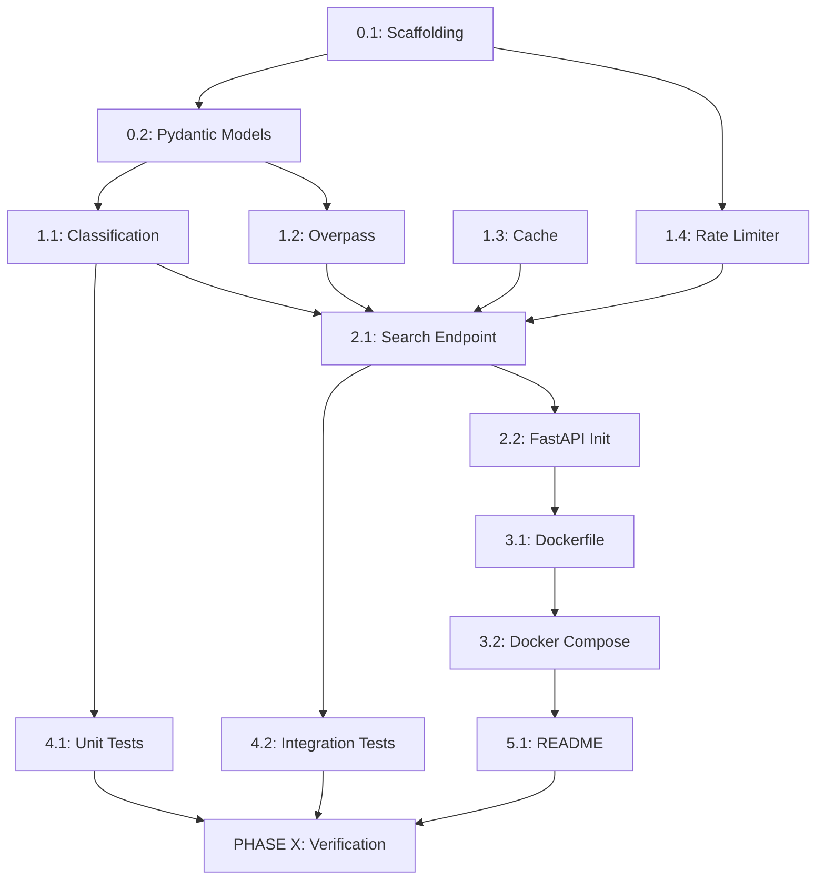

# FastAPI OSM Backend - Implementation Plan

## 📋 Overview

Production-ready MVP backend servisi: Python FastAPI ile OSM Overpass API kullanarak konum bazlı mekan arama (**okul seviyesi** ve **B2B yerler**). Mobil ve web client'lar için REST API.

**Core Value:** Google Maps API olmadan, açık kaynak OSM verisi ile akıllı okul seviyesi sınıflandırma ve B2B mekan arama.

---

## 🎯 Success Criteria

| Metric | Target | Verification |
|--------|--------|--------------|
| **Endpoint Response** | < 3s (retry dahil) | cURL testleri |
| **Cache Hit Rate** | > 70% after warmup | Log analizi |
| **Classification Accuracy** | > 85% (TR okul isimleri) | Manuel spot check 20 okul |
| **Rate Limit Enforcement** | 60 req/min/IP | Bombardman testi |
| **Docker Build** | Successful | `docker-compose up` |
| **No Secrets in Code** | 0 hardcoded | `security_scan.py` |

---

## 🏗️ Project Type

**BACKEND API** (Pure REST, no frontend)

---

## 🔧 Tech Stack

| Layer | Technology | Rationale |
|-------|----------|-----------|
| **Framework** | FastAPI 0.115+ | Native async, auto OpenAPI, type hints |
| **HTTP Client** | httpx | Async Overpass calls |
| **Cache** | Python dict (in-memory) | MVP basitlik, TTL ile expire |
| **Rate Limiting** | slowapi | FastAPI native middleware |
| **Validation** | Pydantic v2 | Type-safe request/response |
| **Deployment** | Docker + uvicorn | User requirement |
| **Testing** | pytest + httpx.AsyncClient | Async test support |

**Why NOT Redis for cache?** MVP için over-engineering, 5dk TTL için dict yeterli.

---

## 📂 File Structure

```
backend/
├── app/
│   ├── __init__.py
│   ├── main.py              # FastAPI app, CORS, rate limiter init
│   ├── api.py               # GET /api/search endpoint + validation
│   ├── overpass.py          # Overpass query builder + HTTP calls
│   ├── classify.py          # School level + B2B type classification logic
│   ├── models.py            # Pydantic models (Place, SearchParams)
│   ├── cache.py             # TTL-based in-memory cache
│   └── rate_limit.py        # IP-based 60 req/min limiter
├── tests/
│   ├── __init__.py
│   ├── test_classify.py     # Unit: keyword matching logic
│   ├── test_api.py          # Integration: /api/search endpoint
│   └── test_overpass.py     # Mock Overpass responses
├── requirements.txt
├── Dockerfile
├── docker-compose.yml
├── .env.example
├── .dockerignore
└── README.md
```

---

## 🚀 Task Breakdown

### PHASE 0: Foundation (P0 - Security & Structure)

#### Task 0.1: Project Scaffolding
**Agent:** `backend-specialist`  
**Skill:** `python-patterns`

**INPUT:** User requirements  
**OUTPUT:** 
- `backend/` directory structure
- `requirements.txt` with pinned versions
- `.env.example` with `PORT=8000`, `OVERPASS_URL=https://overpass-api.de/api/interpreter`
- `.dockerignore` (exclude `__pycache__`, `.pytest_cache`, `.env`)

**VERIFY:**
```bash
ls backend/app/*.py  # 7 files
cat requirements.txt # fastapi[standard], httpx, slowapi, pydantic
```

**Dependencies:** None  
**Estimated Time:** 5 min  
**Rollback:** Delete `backend/` folder

---

#### Task 0.2: Pydantic Models
**Agent:** `backend-specialist`  
**Skill:** `python-patterns`

**INPUT:** API spec from user  
**OUTPUT:** `models.py` with:
- `SearchParams` (lat, lon, radius, type validation)
  - `type: Literal["factory", "office", "workshop", "kindergarten", ...]`
  - `radius: int = Field(default=1500, ge=100, le=5000)`
- `Place` model (id, name, type, lat, lon, address, tags, source)
- `address` as optional nested dict

**VERIFY:**
```python
from app.models import SearchParams, Place
params = SearchParams(lat=41.0, lon=29.0, radius=1500, type="kindergarten")
assert params.radius == 1500
```

**Dependencies:** Task 0.1  
**Estimated Time:** 7 min  
**Rollback:** Revert `models.py`

---

### PHASE 1: Core Logic (P1 - Business Logic)

#### Task 1.1: Classification Engine
**Agent:** `backend-specialist`  
**Skill:** `python-patterns`, `clean-code`

**INPUT:** User's school heuristics + B2B rules  
**OUTPUT:** `classify.py` with:
- `classify_school_level(tags: dict, name: str) -> str | None`
  - Priority: ISCED tags > name keywords
  - Keywords: ilkokul, ortaokul, lise, özel, kolej
  - Return: "primary_school", "middle_school", "high_school", "private_school", "college_keyword"
- `classify_b2b_type(tags: dict, element_type: str) -> str | None`
  - Return: "factory", "office", "workshop" based on OSM tags
- `has_name(tags: dict) -> bool`

**VERIFY:**
```python
from app.classify import classify_school_level
result = classify_school_level({"amenity": "school"}, "Atatürk İlkokulu")
assert result == "primary_school"

result2 = classify_school_level({"amenity": "school", "isced:level": "2"}, "Unknown")
assert result2 == "middle_school"  # Tag priority
```

**Dependencies:** Task 0.2  
**Estimated Time:** 15 min  
**Rollback:** Revert `classify.py`

**⚠️ RISK:** TR karakter edge case (İ vs i) → Use `.lower()` + `casefold()`

---

#### Task 1.2: Overpass Query Builder
**Agent:** `backend-specialist`  
**Skill:** `api-patterns`

**INPUT:** User's Overpass retrieval approach  
**OUTPUT:** `overpass.py` with:
- `build_query(lat, lon, radius, requested_type) -> str`
  - School types → `amenity=kindergarten` OR `amenity=school`
  - B2B types → `industrial=*` OR `man_made=works` OR `craft=*` etc.
  - Use `out center;` for ways/relations
- `fetch_overpass(query: str, timeout: int = 15) -> dict`
  - Retry logic (3 attempts, exponential backoff: 1s, 2s, 4s)
  - Raise 502 on final failure
  - Use `httpx.AsyncClient` with 5s individual timeout

**VERIFY:**
```python
query = build_query(41.0, 29.0, 1500, "kindergarten")
assert "amenity=kindergarten" in query
assert "[timeout:15]" in query
assert "out center" in query
```

**Dependencies:** Task 0.2  
**Estimated Time:** 12 min  
**Rollback:** Revert `overpass.py`

**⚠️ RISK:** Overpass timeout → Mitigated by retry + backoff strategy

---

#### Task 1.3: TTL Cache Implementation
**Agent:** `backend-specialist`  
**Skill:** `python-patterns`

**INPUT:** User's cache strategy (type-based TTL)  
**OUTPUT:** `cache.py` with:
- `TtlCache` class
  - `get(key: str) -> dict | None`
  - `set(key: str, value: dict, ttl_seconds: int)`
  - Auto-cleanup on get (check expiry)
- `get_ttl_for_type(place_type: str) -> int`
  - Schools: 3600s (1hr)
  - B2B: 300s (5min)
- Cache key format: `f"{lat},{lon},{radius},{type}"`

**VERIFY:**
```python
from app.cache import TtlCache, get_ttl_for_type
cache = TtlCache()
cache.set("test", {"data": 1}, ttl_seconds=1)
assert cache.get("test") == {"data": 1}
import time; time.sleep(2)
assert cache.get("test") is None  # Expired
```

**Dependencies:** None  
**Estimated Time:** 10 min  
**Rollback:** Revert `cache.py`

---

#### Task 1.4: Rate Limiter Setup
**Agent:** `security-auditor`  
**Skill:** `vulnerability-scanner`

**INPUT:** User requirement (60 req/min per IP)  
**OUTPUT:** `rate_limit.py` + integration in `main.py`
- Use `slowapi` with `@limiter.limit("60/minute")`
- IP-based limiting (read from `request.client.host`)
- Return 429 with `Retry-After` header

**VERIFY:**
```bash
# Bombardman test (requires server running)
for i in {1..70}; do curl http://localhost:8000/api/search?lat=41&lon=29&radius=1000&type=factory; done
# Last 10 should return 429
```

**Dependencies:** Task 0.1  
**Estimated Time:** 8 min  
**Rollback:** Remove limiter from `main.py`

**⚠️ RISK:** Distributed deployments → IP detection breaks behind proxy. Solution: Read `X-Forwarded-For` header.

---

### PHASE 2: API Endpoint (P2 - Integration)

#### Task 2.1: Search Endpoint Implementation
**Agent:** `backend-specialist`  
**Skill:** `api-patterns`, `clean-code`

**INPUT:** All previous components  
**OUTPUT:** `api.py` with:
- `GET /api/search` handler
  - Validate `SearchParams` (Pydantic auto-validation)
  - Check cache first
  - Call `fetch_overpass()` if cache miss
  - Filter results by `requested_type` using `classify.py`
  - Sort by distance (haversine formula) - for mobile UX
  - Cache filtered results (type-based TTL)
  - Return `List[Place]`
- Error handling:
  - 400: Invalid params
  - 429: Rate limit
  - 502: Overpass failure

**VERIFY:**
```bash
curl "http://localhost:8000/api/search?lat=41.015137&lon=28.979530&radius=1500&type=kindergarten"
# Should return JSON array of kindergartens only
# Check response has "type": "kindergarten" for all items
```

**Dependencies:** Tasks 1.1, 1.2, 1.3, 1.4  
**Estimated Time:** 20 min  
**Rollback:** Revert `api.py`

**⚠️ RISK:** Overpass returns 10,000 schools → Filter AFTER classification may be slow. Solution: Limit to 100 results max.

---

#### Task 2.2: FastAPI App Init
**Agent:** `backend-specialist`  
**Skill:** `python-patterns`

**INPUT:** All components ready  
**OUTPUT:** `main.py` with:
- FastAPI app instance
- CORS middleware (allow all origins for MVP)
- Rate limiter middleware
- Include router from `api.py`
- Health check endpoint `GET /health`
- OpenAPI docs at `/docs`

**VERIFY:**
```bash
uvicorn app.main:app --reload
curl http://localhost:8000/health  # {"status": "ok"}
curl http://localhost:8000/docs    # Swagger UI
```

**Dependencies:** Task 2.1  
**Estimated Time:** 10 min  
**Rollback:** Revert `main.py`

---

### PHASE 3: Docker & Deployment (P3 - Ops)

#### Task 3.1: Dockerfile
**Agent:** `backend-specialist`  
**Skill:** `deployment-procedures`

**INPUT:** User requirement (Docker deployment)  
**OUTPUT:** `Dockerfile` with:
- Base: `python:3.12-slim`
- WORKDIR `/app`
- Copy `requirements.txt` → `pip install`
- Copy `backend/app/` → `/app/app/`
- EXPOSE 8000
- CMD: `uvicorn app.main:app --host 0.0.0.0 --port 8000`

**VERIFY:**
```bash
docker build -t fastapi-osm .
docker run -p 8000:8000 fastapi-osm
curl http://localhost:8000/health  # Should work
```

**Dependencies:** Task 2.2  
**Estimated Time:** 8 min  
**Rollback:** Delete `Dockerfile`

---

#### Task 3.2: Docker Compose
**Agent:** `backend-specialist`  
**Skill:** `deployment-procedures`

**INPUT:** Dockerfile exists  
**OUTPUT:** `docker-compose.yml` with:
- Service: `backend`
  - Build from `Dockerfile`
  - Ports: `8000:8000`
  - Env file: `.env`
  - Restart: `unless-stopped`

**VERIFY:**
```bash
docker-compose up -d
docker-compose ps  # Should show backend running
curl http://localhost:8000/health
docker-compose down
```

**Dependencies:** Task 3.1  
**Estimated Time:** 5 min  
**Rollback:** Delete `docker-compose.yml`

---

### PHASE 4: Testing (P4 - Quality)

#### Task 4.1: Classification Unit Tests
**Agent:** `backend-specialist`  
**Skill:** `testing-patterns`, `tdd-workflow`

**INPUT:** `classify.py` logic  
**OUTPUT:** `tests/test_classify.py` with:
- Test school priority (tags > name)
- Test TR keyword matching (ilkokul, ortaokul, lise, kolej)
- Test ambiguous case handling (multiple keywords)
- Test B2B classification (factory, office, workshop)
- Test unnamed filter logic

**VERIFY:**
```bash
pytest tests/test_classify.py -v
# All tests pass
```

**Dependencies:** Task 1.1  
**Estimated Time:** 15 min  
**Rollback:** Delete test file

---

#### Task 4.2: API Integration Tests
**Agent:** `backend-specialist`  
**Skill:** `testing-patterns`

**INPUT:** `/api/search` endpoint  
**OUTPUT:** `tests/test_api.py` with:
- Test valid request (mock Overpass)
- Test invalid type (should 400)
- Test radius out of bounds (should 400)
- Test Overpass failure (should 502)
- Test cache hit (2nd request faster)
- Test rate limit (61st request 429)

**VERIFY:**
```bash
pytest tests/test_api.py -v --cov=app
# Coverage > 80%
```

**Dependencies:** Task 2.1  
**Estimated Time:** 20 min  
**Rollback:** Delete test file

---

### PHASE 5: Documentation (P5 - Clarity)

#### Task 5.1: README
**Agent:** `backend-specialist`  
**Skill:** `documentation-templates`

**INPUT:** All implementation complete  
**OUTPUT:** `README.md` with:
- Project overview
- Setup instructions (local + Docker)
- API documentation:
  - Endpoint spec
  - Request examples for each type
  - Response format
- OSM tagging limitations:
  - School classification accuracy depends on name tags
  - B2B unnamed places may be noisy
  - Heuristics are TR-focused
- Rate limits
- Cache behavior
- Contributing guidelines

**VERIFY:** Read README, follow setup steps on fresh machine

**Dependencies:** All previous tasks  
**Estimated Time:** 15 min  
**Rollback:** Revert README

---

## 🔐 PHASE X: Final Verification

> 🔴 **MANDATORY: ALL scripts must run and pass before marking complete**

### Checklist

#### Security (P0)
```bash
python .agent/skills/vulnerability-scanner/scripts/security_scan.py backend/
```
- [ ] No hardcoded secrets
- [ ] No SQL injection vectors (N/A - no DB)
- [ ] No unsafe eval/exec
- [ ] Dependencies have no critical CVEs

#### Code Quality (P1)
```bash
cd backend
pip install ruff
ruff check app/
```
- [ ] No linting errors
- [ ] Type hints present
- [ ] No unused imports

#### Testing (P2)
```bash
pytest tests/ -v --cov=app --cov-report=term-missing
```
- [ ] All tests pass
- [ ] Coverage > 80%
- [ ] No flaky tests

#### Docker Build (P3)
```bash
docker-compose up --build -d
docker-compose ps
```
- [ ] Build successful
- [ ] Container running
- [ ] Health check returns 200

#### Manual Verification (P4)
Test each type:
```bash
# Kindergarten
curl "http://localhost:8000/api/search?lat=41.015137&lon=28.979530&radius=1500&type=kindergarten"

# Primary School
curl "http://localhost:8000/api/search?lat=41.015137&lon=28.979530&radius=2000&type=primary_school"

# Factory
curl "http://localhost:8000/api/search?lat=41.015137&lon=28.979530&radius=3000&type=factory"

# Office
curl "http://localhost:8000/api/search?lat=41.015137&lon=28.979530&radius=1500&type=office"

# Workshop
curl "http://localhost:8000/api/search?lat=41.015137&lon=28.979530&radius=2000&type=workshop"

# College keyword
curl "http://localhost:8000/api/search?lat=41.015137&lon=28.979530&radius=2000&type=college_keyword"
```

Validation for each:
- [ ] Response time < 3s (first call)
- [ ] Response time < 500ms (cached call)
- [ ] Only requested type returned
- [ ] Results sorted by distance (closest first)
- [ ] All places have `id`, `type`, `lat`, `lon`

#### Rule Compliance (P5)
- [ ] Socratic questions answered (user delegated decisions)
- [ ] Production-lean approach (no over-engineering)
- [ ] Clean code principles followed
- [ ] No placeholder comments

---

## 📊 Dependency Graph



---

## 🎯 Agent Assignment Summary

| Phase | Agent | Tasks | Skill Focus |
|-------|-------|-------|-------------|
| **P0** | `backend-specialist` | 0.1, 0.2 | `python-patterns` |
| **P1** | `backend-specialist` | 1.1, 1.2, 1.3 | `api-patterns`, `clean-code` |
| **P1** | `security-auditor` | 1.4 | `vulnerability-scanner` |
| **P2** | `backend-specialist` | 2.1, 2.2 | `api-patterns` |
| **P3** | `backend-specialist` | 3.1, 3.2 | `deployment-procedures` |
| **P4** | `backend-specialist` | 4.1, 4.2 | `testing-patterns`, `tdd-workflow` |
| **P5** | `backend-specialist` | 5.1 | `documentation-templates` |

---

## ⚠️ Known Limitations

### OSM Data Quality
- **School Names:** Classification accuracy depends on Turkish naming conventions. International schools may be misclassified.
- **B2B Unnamed Places:** Industrial zones without names may create noise. MVP includes `unnamed: true` flag.
- **Data Freshness:** OSM updates are community-driven. New businesses may take weeks to appear.

### Performance
- **Cold Start:** First request per location takes 2-3s (Overpass latency).
- **Cache Invalidation:** No manual invalidation in MVP. Stale data possible for TTL duration.

### Heuristics
- **TR-Focused:** Keywords like "ilkokul", "ortaokul" work for Turkey. Other languages need separate logic.
- **Ambiguous Names:** "Özel İlkokul Ortaokul" matches both - uses priority (primary > middle).

---

## 🚀 Next Steps After Plan Approval

1. **Start PHASE 0:** Create project structure
2. **Incremental Testing:** Run tests after each phase
3. **Docker Build:** Verify containerization works
4. **PHASE X:** Final verification with all scripts

---

**Plan Created:** 2026-01-26  
**Estimated Total Time:** ~2.5 hours  
**Target Deployment:** Docker container on VPS
